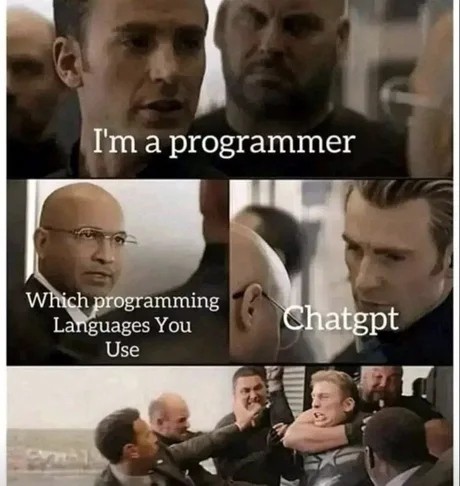

Being a skilled developer requires a careful balance in this fast-paced AI era. You should refine your skills naturally while still leveraging AI. It's not easy, as it takes practice to ask the right questions and create a fresh perspective (if you're stuck in old habits). Let me share a few ideas for striking the right balance.

## Use AI for Understanding, Not Just Answers

When using AI assistants, it's important to prioritize learning over easy answers.

Instead of directly asking ChatGPT to answer a problem, ask it to explain the concept. This encourages learning and understanding.

**Bad**: "Write a function to sort a list in Python."
**Good**: "Can you explain how sorting algorithms work?"

## Break Down Your Problem

Tackling complex problems piece by piece can prevent over-reliance on AI. Break your problem into smaller parts and try to solve each yourself. If you get stuck, ask ChatGPT about that particular issue. This way, you won't depend on the AI for the whole solution, just help in a specific part.

**Bad**: "I want to build a chat application. How do I do it?"
**Good**: "I'm having trouble setting up WebSockets for real-time communication in my chat application. Can you explain how WebSockets work?"

## Ask for Resources, Not Direct Solutions

AI can help you find educational materials like documentation, articles, and tutorials.

For instance, ChatGPT can point you toward useful resources like documentation, articles, or tutorials. Going through these can give you a better understanding of your problem.

**Bad (overly broad)**: "How do I create a web API with FastAPI?"
**Good**: "Can you recommend some good resources or tutorials to get started with FastAPI?"

## Request Feedback

Another approach is to get AI feedback on your own work.

Rather than having ChatGPT generate a solution for you, come up with one yourself and get its feedback. You're doing the work, but AI is helping you refine and improve it.

**Bad**: "Write a SQL query to get the total sales from this database."
**Good**: "Here's my SQL query to calculate the total sales. Can you review it and suggest improvements?"

## Use the Socratic Method

Chat with AI in an exploratory dialogue. Don't just get the answers; have a conversation to explore ideas further. Ask "why" often. This encourages better understanding.

**Example**:

**You**: "How does a linked list work?"
**ChatGPT**: "A linked list is a data structure in which elements, known as nodes, are connected by pointers. Each node contains data and a reference (or pointer) to the next node in the sequence."
**You**: "Why would someone choose a linked list over an array?"
**ChatGPT**: "Linked lists have several advantages over arrays... (and so on)."

Another example might be if you ask, '**How does a hash table work in Python?**' as opposed to just accepting the explanation, follow up with '**Why is hashing used?**' and '**How does hash table insertion improve lookup time complexity compared to a list?**'. Asking clarifying questions will lead you to gain a deeper understanding.

## Self-Reflect Before Asking

It's beneficial to reflect on your own process before using ChatGPT. Hence, take the time to explain the problem clearly, and consider it thoroughly.

Defining the problem can often help you find the answer.

**Example**:

**Self-Thought**: "I'm trying to filter this list, but the standard loop isn't efficient. Maybe there's a built-in function or a different data structure that's more efficient?"

If you haven't found the answer after thinking it over, then your question for ChatGPT will be more specific and focused.

## Reduce Frequency

This part is hard, but you really want to be intentional about when you turn to AI. Set a personal rule for when you'll consult ChatGPT to help you stay persistent and build your problem-solving skills.

Consider what timeframe works for your learning style and current skill level. For instance:

- If you're a beginner, limit AI use to only after you've spent 60-90 minutes thoroughly trying to solve a problem yourself. As a beginner, you likely need more time wrestling with new concepts yourself before seeking help.

- If you have intermediate skills, perhaps 30-45 minutes of self-attempting is enough before consulting AI for hints.

- If you're pretty advanced, maybe 15-30 minutes of self-attempting is sufficient before getting AI input. You likely can grasp new concepts faster, so minimize wasted time.

The exact minutes aren't important; get a decent mental workout, but don't burn out. The key is to challenge yourself based on your abilities. As you improve, reduce the time you allow before AI help. This pushes you to grow your skills and self-sufficiency. But have a limit to avoid unproductive struggles.

Finding the right timeframe takes some trial and error. If you frequently reach your time limit with no progress, extend it. If you rarely hit the limit, shorten it.

## Real-World Example

Jane was new to Python and Django. She was building a simple blog site and got stuck setting up the URL routes. Rather than asking ChatGPT to write the routes for her, she asked it to explain Django URL routing and show examples.

After reading ChatGPT's explanation, Jane tried creating a few routes in her `views.py` file but got confused about the syntax. She asked ChatGPT specific questions about the route syntax as she coded, so she could understand how to structure them properly.

If you noticed, there was originally a mistake in this example, mentioning routes in `views.py` instead of `urls.py`; great catch! This was a small trick to demonstrate that AI, like ChatGPT, sometimes provides incorrect information. As helpful as AI can be, you should continue using your own critical thinking skills to identify potential errors. AI shouldn't be relied on 100% - stay focused, notice mistakes, and keep sharpening your own knowledge.

## Conclusion

Combining these strategies into your learning can create a balance between relying on yourself and using AI tools. But hey, don’t feel you need to overhaul everything at once; it doesn’t have to be an all-or-nothing approach. Try out a suggestion or two, see what works for you, and build from there. _Remember, **the goal is always to understand, not just to get the answer**_.
